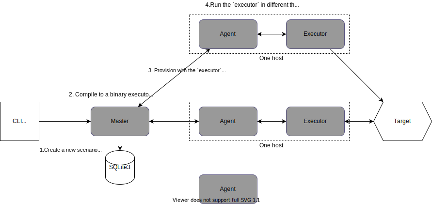
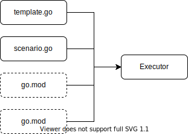
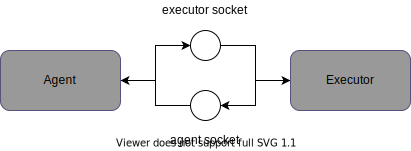

Gobench, một benchmark framework

*Tác giả: Nguyễn Quốc Đính, Phạm Đức Thọ*

19/11/2020

## 1. Giới thiệu Gobench

Ở Veriksystems, chúng tôi làm việc với các hệ thống Internet of Things (IoT) từ
xây dựng phần cứng, viết firmware, ứng dụng di động, đến hệ thống backend. Khi
phát triển hệ thống mới, chúng tôi có nhu cầu, và cũng theo yêu cầu của khách
hàng, benchmark để kiểm tra tính bền vững (robustness), tính sẵn dùng
(availability), và xử lý lỗi (error handling) dưới tải lớn.

Đặt tính của hệ thống IoT là có nhiều loại protocol khác nhau, và thường giữ kết
nối giữa client và server. Sau khảo sát thấy các công cụ mã nguồn mở hiện tại
chưa đáp ứng được nhu cầu, chúng tôi xây dựng Gobech một benchmark framework mã
nguồn mở bằng Golang. Gobech được xây dựng với bốn mục tiêu sau:

1. Expressive: Kịch bản benchmark phải đủ phức phức tạp để thể hiện các luồng
   chương trình khác nhau. Các công cụ có dạng `./tool [options]
   http://auth@host/path#hash` sẽ không đáp ứng được nhu cầu.

2. Nhiều loại protocol khác nhau: Bên cạnh HTTP, chúng tôi thường sử dụng MQTT,
   và NATS. Chương trình benchmark cần phải hỗ trợ nhiều loại protocol khác nhau
   và có thể dễ dàng mở rộng.

3. Kết quả thời gian thực: Các thông số benchmark phải được hiển thị theo thời
   gian, và tốt nhất nằm trên biểu đồ. Việc chỉ tóm gọn kết quả cuối cùng làm
   mất đi việc quan sát tính cale up/down trong quá trình benchmark.

4. Scalable: Hỗ trợ đến 1 triệu kết nối đồng thời cho các protocol đòi hỏi có
   consistent connection như MQTT hay NATS. Trong trường hợp chương trình client
   tạo một kết nối (dựa trên TCP) đến một endpoint, địa chỉ kết nối này được thể
   hiện bởi bốn thông số <IP nguồn, port nguồn, IP đích, port đích>, do đó số
   lượng kết nối bị giới hạn bởi con số 65536. Để đạt được mục tiêu 1M kết nối
   và nhiều hơn, phải có một cựm (cluster) cá client phối hợp với nhau.

Vào thời điểm viết bài báo nào, Gobench đã đạt được các mục tiêu (1), (2) và
(3), và được host tại https://github.com/gobench-io/gobench. Chúng tôi đang tích
cực phát triển chức năng (4) cho bản release v0.1.0.

Bài này được chia thành các mục như sau. Mục 2 giới thiệu cơ chế hoạt động của
Gobench. Chúng tôi trình bày cách implement hệ thống ở Mục 3. Mục 4 so sánh hiệu
năng của Gobench và một số chương trình mã nguồn mở trong việc sử dụng HTTP
client. Gobench hiện tại vẫn đang được phát triển tích cực, chúng tôi sẽ liệt kê
những vấn đề todo ở Mục 5.

## 2. Cơ chế hoạt động

Cũng như các chương trình benchmark khác, Gobench tạo ra một hoặc nhiều client
tấn công vào một đối tượng (target) cần kiểm tra. Vấn đề đặt ra là kịch bản cho
client hoạt động như thế nào. Có thể đơn giản là options cho CLI như hey, ab,
vegeta; hoặc XML như Jmeter; hoặc domain specific language (DSL) như Gatling,
MZBench; hoặc ngôn ngữ lập trình phổ biến như Nodejs ở k6, Python ở Locust.

Trở ngại của DSL là người dùng phải học ngôn ngữ mô tả mới, và DSL bộc lộ hạn
chế khi kịch bản mô phỏng trở nên phức tạp.

### 2.1. Kịch bản test

Vì Gobench được xây dựng trên Go, kịch bản cũng được viết bằng Go. Và vì Go đơn
giản, dễ đọc, dù bạn chưa từng làm việc với ngôn ngữ này trước đó, tôi tin bạn
không mất nhiều thời gian để hiểu được kịch bản (scenario) dưới đây.

```{go}
package main

import (
    "context"
    "log"
    "time"

    httpClient "github.com/gobench-io/gobench/clients/http"
    "github.com/gobench-io/gobench/executor/scenario"
)

func export() scenario.Vus {
    return scenario.Vus{
        {
            Nu:   12,
            Rate: 100,
            Fu:   f,
        },
    }
}

func f(ctx context.Context, vui int) {
    for {
        log.Println("tic toc")
        time.Sleep(1 * time.Second)
    }
}
```

Một kịch bản phải định nghĩa một `func export()` trả về một mảng các virtual
user (vu). `Vu` cho phép tester định nghĩa hành vi của một người dùng trong
chương trình test.

Mỗi `vu` được định nghĩa bởi ba thông số :
1. `Nu` là tổng số lượng user cho loại `vu` này.
2. `Rate` là tốc độ khởi tạo user của lớp `vu` này. Gobench không tạo tất cả
   user cùng một lúc, mà tuần tự dựa trên phân bố Poisson. Trong ví dụ trên 12
   user được khởi tạo với lamda = 100. Như vậy trung bình sau 0.12 giây toàn bộ
   user của lớp `vu` này sẽ được tạo xong.
3. `Fu` định nghĩa hành vi của một `vu`. Ở ví dụ trên, user chi đơn giản in
   tictoc sau mỗi một giây. 

Mỗi user trong `vu` sẽ được chạy trong mỗi goroutine riêng biệt. Vì goroutine là
một greenthread của go sử dụng ít tài nguyên, nên Gobench có khả năng tạo được
một lượng lớn các user trong mỗi host.

### 2.2. Master, Agent, và Executor

Gobench khi nhận được một kịch bản sẽ đưa vào hàng đợi và thực thi tuần tự. Hình
1 mô tả cách thức hoạt động của Gobench. Để tiện theo dõi, chúng tôi giới thiệu
các khái niệm được sử dụng trong hệ thống như sau.



Hình 1: Mô hình hoạt động của Gobench bao gồm Master, Agent, và Executor. Master
lưu kết quả vào cơ sở dữ liệu nhúng SQLite3.

#### 2.2.1. Master

Mỗi hệ thống Gobench có một Master. Như tên gọi của nó, Master là điều phối viên
của hệ thống. Đầu tiên, Master là nơi giao tiếp với tester thông qua Web UI hoặc
HTTP API. Master tuần tự lấy các kịch bản ra để thực thi. Vào mỗi thời điểm, chỉ
một kịch bản hoạt động.



Hình 2: Master tạo nên Executor từ kịch bản. scenario.go là kịch bản người dùng
tạo nên. template.go là mã nguồn được Master tạo nên. Tester có thể khai báo hai
file go.mod và go.sum để chỉ định các package phụ thuộc.

Để chạy một kịch bản, Master trước tiên dịch kịch bản thành một file thực thi
gọi là Executor như Hình 2, sau đó gởi file này đến các Agent trong cluster. Mỗi
Agent nhận được một công việc (job) bao gồm (1) file thực thi, (2) `Nu_{i}`,
`Rate_{i}` là số lượng user và tốc độ khởi tạo tương ứng cho Agent `i`. Dĩ nhiên
tổng `Nu_{i}`, `Rate_{i}` phải bằng Nu và Rate tương ứng. Một cách đơn giản,
Gobench chia điều Nu và Rate trên tổng số các Agent trong hệ thống. Một cách
phức tạp hơn `Nu_{i}` sẽ tỉ lệ thuận với tài nguyên (CPU, RAM, băng thông) của
một Agent. Chúng tôi chọn cách đơn giản trong implement của Gobench.

Khi một kịch bản được thực thi, các Agent sẽ báo báo các metric về Master.
Master lưu kết quả này vào trong cơ sở dữ liệu nhúng là sqlite3. Chúng tôi chọn
sqlite3 vì CSDL này đi kèm với chương trình, đơn giản khi vận hành. Nghi ngại về
tốc độ ghi của sqlite3 sẽ không thành vấn đề khi metric được giản lượt hóa trước
khi đưa về Master (chúng tôi sẽ đề cập kỹ hơn trong phần sau). Là loại SQL cũng
giúp cho việc truy vấn thuận tiện hơn các loại NoSQL nhúng khác.

Master là single point of failure (SPOF) của hệ thống. Sẽ rất dễ dàng kiểm tra
trạng thái hoạt động của Master. Với việc chỉ có duy nhất một Master, khả năng
Master chết rất ít khi xảy ra. Nếu Master chết, một instance mới có thể được
dựng lên, bất kì job nào đang chạy sẽ bị hủy. Tester có thể chạy lại kịch bản
này nếu muốn.

#### 2.2.2. Agent

Mỗi hệ thống Gobench có một hoặc nhiều Agent. Agent có thể chạy trên bất cứ hệ
thống Unix nào. Agent giữ liên lạc với Master để tạo nên cluster. Khi Agent nhận
job từ Master, nó sẽ chạy file executor trong một thread riêng biệt. Agent và
Executor liên lạc với nhau thông qua Unix socket. 

Agent đóng vai trò trung gian trong việc báo cáo metric từ Executor đến Master.
Và ở chiều ngược lại, trong quá trình hoạt động, nếu Agent nhận lệnh hủy một
job, nó sẽ giết Executor thread.

Trên nền Unix socket, giao tiếp giữa Agent và Executor là gRPC như Hình 3.



Hình 3: Giao tiếp giữa Agent và Executor là gRPC thông qua Unix socket.

#### 2.2.3. Executor

Executor khởi chạy bởi Agent khi thực thi một job mới. Mỗi host sẽ chạy hoặc là
Master hoặc là Agent, và mỗi Agent chỉ tạo chạy duy nhất một Executor. Nguyên
nhân cho việc này là benchmark thường sử dụng nhiều tài nguyên (CPU, RAM, băng
thông mạng). Tester nên cài đặt để Agent và Executor sử dụng hết các tài nguyên
nó đang có.

Executor là nơi chạy kịch bản benchmark. Các kịch bản này thường sử dụng các thư
viện (hiện tại là HTTP client, MQTT client, NATs client) của Gobench tương tác
với đối tượng cần benchmark. Cứ mỗi hành vi của một client sẽ được ghi nhận lại
trong metric. Ví dụ với HTTP thì số lượt request thành công, thất bại, hay độ
trễ (delay) của request (ns) được báo cáo đến metric collector ở ngay bên trong
Executor. Executor tổng hợp (aggregate) các metric này trước khi chuyển đến
Agent và cuối cùng tập hợp về Master mỗi 10s. Chúng tôi chọn phương pháp này để
giảm số lượng message gởi về Master.

Các metric Gobench hỗ trợ là counter, histogram, và gauge.

<!-- ## 3. Thực hiện -->
### 2.3. Tạo một client mới

Một trong những mục tiêu hàng đầu của Gobench là hỗ trợ nhiều protocol khác
nhau. Để đạt được điều này, API để hỗ trợ client mới phải đơn giản.

Gobench cung cấp hai API để một client báo cáo kết quả về như bên đưới. API đầu
tiên khai báo các metric mà client này hỗ trợ. Ví dụ với MQTT có số lượng các
kết nối thành công, thất bại, độ trễ kết nối, số lượng message pub và sub với
các QoS bằng 0, 1, hoặc 2.

```go
import "github.com/gobench-io/gobench/executor"

executor.Setup(groups)
executor.Notify(metric-id, value)
```

API thứ hai dùng để báo cáo kết quả của một metric nào đấy (đã được đăng ký ở
API đầu tiên).

Việc hỗ trợ client mới dễ dàng đang là thế mạnh của Gobench. Thời gian sắp tới
chúng tôi sẽ hỗ trợ một số giao thức phổ biến khác như gRPC, websocket, graphQL.

## 3. Hiệu năng

Ở mục này chúng tôi sẽ so sánh tốc độ Gobench với một vài chương trình benchmark
HTTP khác.

Khi kiểm tra sức tải của hệ thống (load testing), chúng ta cần qua tâm đến vấn
đề về hiệu suất của chương trình benchmark. Khi chương trình benchmark không đủ
công suất để đáp ứng bài toán mà khách hàng đưa ra, các kết quả mà bạn nhận được
sẽ không còn đáng tin cậy. Chẳng hạn như số lượng các gói tin được xử lý trong
một giây hoặc độ trễ của gói tin. Điều này khiến cho bạn tin rằng, hệ thống của
mình đang chạy một cách ì ạch và rồi bạn đưa ra một bản thảo dài dằng dặc các
tính năng cần được cải thiện, nâng cấp, và có thể phải đập đi xây lại từ đầu.
Thật lãng phí khi tất cả những gì bạn cần làm là đảm bảo chương trình benchmark
đáp ứng đủ công suất. Đây là lý do tại sao bạn cần biết đến hiệu suất của các
chương trình benchmark, nắm được điểm mạnh và điểm yếu của mỗi chương trình để
có được sự lựa chọn phù hợp.

Cách thực hiện kiểm tra hiệu suất của một chương trình benchmark là kiểm tra
chúng với một dịch vụ có hiệu suất cao, ví dụ với HTTP là máy chủ Nginx. Chúng
tôi sử dụng hai máy c5.4xlarge (16 core CPU, 32 GB RAM) trên AWS để tiến hành so
sánh. Trong tất cả các trường hợp, máy chạy Nginx được kiểm tra để đảm báo nó
không sử dụng hết tất cả CPU, và network in/out không vượt quá băng thông cung
cấp (10Gbps).

Trong các chương trình benchmark HTTP phổ biến, chúng tôi chọn k6 (v0.29.0), hey
(v0.1.4), Artillery (v1.6.1), Jmeter (v5.2.1) để so sánh với Gobench. Với một
chương lần chạy chúng tôi thu thập các thông số CPU, RAM, số request trong một
giây (rps). Kết quả được trình bày ở Bảng 1 bên dưới. Kịch bản test là mỗi
client GET trang chính của Nginx với `vu` = 30 trong quãng thời gian 120 giây.

| Chương trình | CPU (%) | RAM (MB) | RPS   |
|--------------|---------|----------|-------|
| hey          | 217.55 | 150       | 27220 |
| k6           | 342    | 556.3     | 26314 |
| Jmeter       | 199    | 814.6     | 26259 |
| Gobench      | 281    | 114.5     | 25686 |
| Artillery    | 107    | 145.3     | 1197  |

Bảng 1: So sánh hiệu năng của một số chương trình benchmark HTTP phổ biến.

hey là chương trình chạy nhanh nhất trong cuộc thi. hey tạo nên 27,200 rps, tiếp
sau đó là k6, Jmeter và Gobench. Nhưng chương trình này tận dụng được thư viện
network tốt (Go, Java) và tận dụng nhiều nhân của host. Đứng cuối danh sách là
Artillery khi chỉ tạo nên khoảng 1197 rps; điều này cũng dễ hiểu vì Artillery
được viết bằng Nodejs và chỉ sử dung 1 nhân của host.

Về RAM sử dụng Gobench, Artillery, hey thật sự nhẹ nhàng khi so sánh với Jmeter
(JVM ưa sử dụng nhiều bộ nhớ) và k6 (mỗi `vu` là một Javascript virtual
machine). Bạn có thể tự hỏi 814 MB RAM là như thế nào? Một server thông thường
vào thời điểm này có vài GB. Vấn đề là RAM sẽ tăng lên khi bạn scale up chương
trình test: (1) chương trình test kéo dài sẽ thu nhập nhiều metric hơn, và (2)
số lượng `vu` tăng lên đồng thời với RAM + CPU (thread).

Về tổng thể Artillery kém nhất trong nhóm. Gobench có tốc độ chậm hơn một chút
so với hey, k6, Jmeter, nhưng bù lại dùng ít RAM hơn. Điều này rất có ích khi
bạn cầng nâng số lượng `vu` lên vài ngàn hoặc vài chục ngàn.

## 4. Kết luận

Có rất nhiều chương trình benchmark vẫn đang được tích cực phát triển. Một số
theo hướng CLI như Wrk, Apachebench, Drill, Hey, Vegeta. Một số chỉ hỗ trợ HTTP
như Locust, k6.

Chương trình gần nhất đạt được bốn mục tiêu ban đầu chúng tôi đưa ra có thể kể
đến là MZBench, Gatling, và Artillery. MZBench là một hệ thống rất thú vị được
viết bởi Machine Zone với Erlang. MZBench scaling rất tốt nhờ vào hỗ trợ của
OTP; đáng tiếc là các tác giả đã ngưng phát triển MZBench, chương trình tải về
từ Github bị lỗi không chạy được. Gobench chịu nhiều ảnh hưởng của MZBench về
thiết kế. Gatling phát triển với Scala và hỗ trợ nhiều loại protocol khác nhau.
Bản community tuy vậy chỉ cho phép chạy trên một node. Cả MZBench và Gatling cho
phép viết kịch bản bằng DSL riêng. Artillery phát triển bởi công ty Shoreditch
Ops bằng NodeJS; kịch bản có thể viết bằng Javascript, do đó khá dễ nắm bắt,
giống Golang. Tuy nhiên chỉ với bản premium thì mới chạy phân tán trên nhiều
node được. Và chính vì sử dụng NodeJS nên chương trình không tận dụng được hết
tài nguyên của host.

Cho đến thời điểm viết bài báo này Gobench đã đạt được ba trong bốn mục tiêu ban
đầu được đặt ra là (1) expressive, (2) hỗ trợ nhiều protocol là HTTP, MQTT,
NATs, và (3) Kết qủa thời gian thực được hiện lên dashboard.

Nếu chỉ chạy trong một node thì khả năng benchmark sẽ bị giới hạn, trong thời
gian sắp tới chúng tôi sẽ xây dựng mục tiêu số (4) là tạo ra scalable benchmark
có khả năng tạo đến 1 triệu kết nối đồng thời. Việc Thêm các loại client phổ
biến khác như gRPC, websocket, graphQL cũng nằm trong danh sách cần phải làm.

Nhận thấy một số tính năng thú vị của Gobench so với các chương trình khác trên
thị trường và vẫn còn nhiều vấn đề  khác cần giải quyết, vì vậy hãy xem đây là
lời kiêu gọi của chúng tôi đến contributor vậy.
